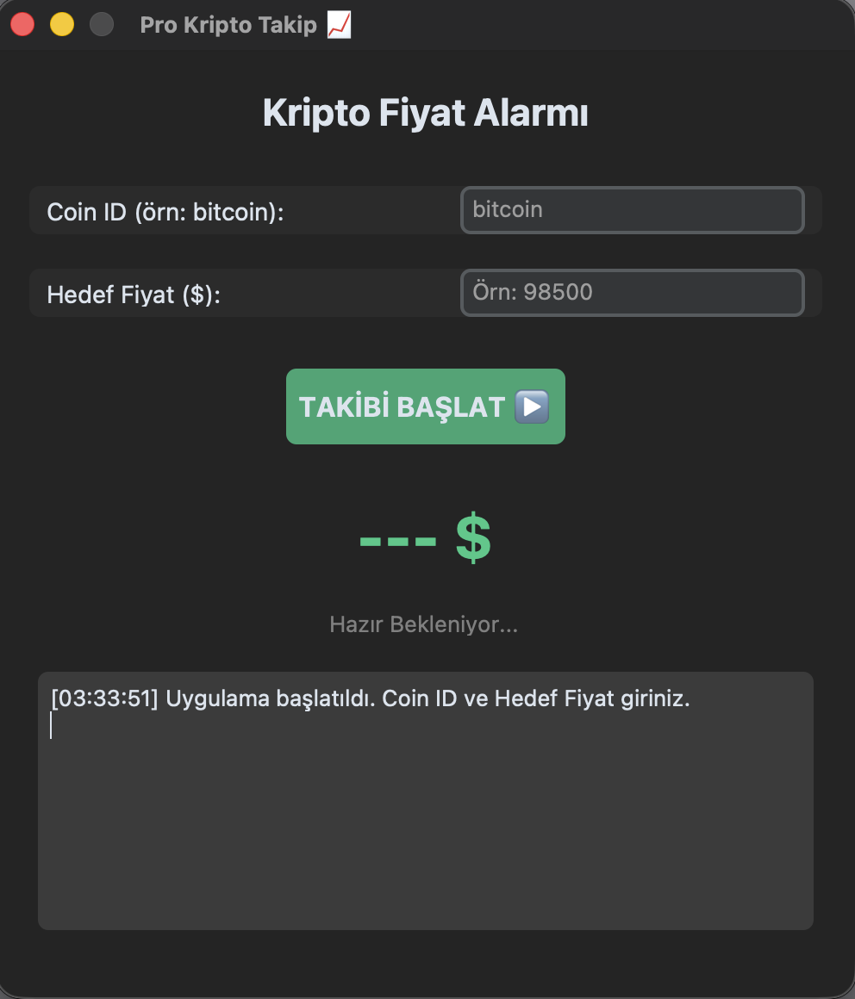
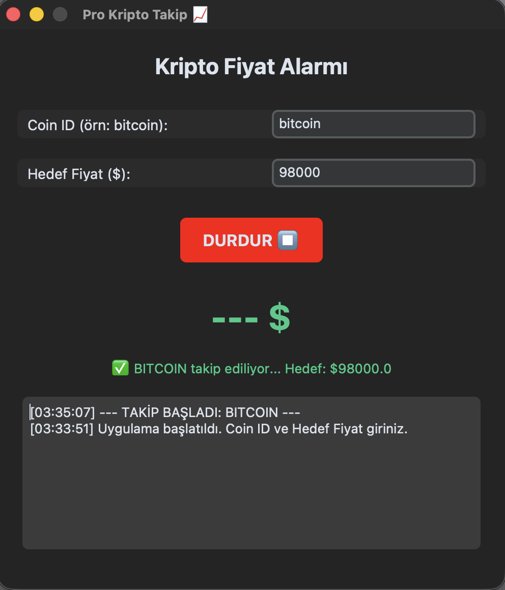

<div align="center">
  <h1>📈 Crypto Watcher GUI</h1>
  
  <p>
    <strong>Gerçek Zamanlı Kripto Para Takip ve Alarm Sistemi</strong>
  </p>

  <p>
    <a href="https://www.python.org/">
      
    </a>
    <a href="https://github.com/TomSchimansky/CustomTkinter">
      
    </a>
    <a href="https://www.coingecko.com/en/api">
      
    </a>
  </p>
</div>

---

## 🚀 Proje Hakkında

**Crypto Watcher GUI**, yatırımcıların ve meraklıların seçtikleri kripto para birimlerini anlık olarak takip etmelerini sağlayan, belirledikleri fiyat hedeflerine ulaşıldığında **masaüstü bildirimi** gönderen bir Python masaüstü uygulamasıdır.

Bu proje, terminal tabanlı botların aksine modern bir arayüz sunar ve arka planda **Threading** mimarisi kullanarak akıcı bir kullanıcı deneyimi sağlar. Ayrıca tüm fiyat hareketlerini analiz için `.csv` dosyasına kaydeder.

---

## ✨ Temel Özellikler

* **💎 Canlı Veri Akışı:** CoinGecko API üzerinden anlık fiyat çekimi (SSL Bypass ve User-Agent spoofing ile güçlendirilmiş).
* **🔔 Akıllı Bildirim Sistemi:** Hedef fiyata ulaşıldığında veya sert düşüşlerde sistem tepsisinden (System Tray) uyarı gönderir.
* **💾 Veri Loglama:** Çekilen her fiyat verisini tarih ve saat damgasıyla `fiyat_gecmisi_gui.csv` dosyasına kaydeder.
* **⚡ Modern Arayüz:** `CustomTkinter` ile geliştirilmiş, göz yormayan karanlık mod (Dark Mode) tasarımı.
* **🔄 Asenkron Çalışma:** Arayüz donmadan arka planda veri takibi (Multi-threading).

---

## 🛠️ Kurulum

Projeyi yerel makinenizde çalıştırmak için adımları takip edin:

**1. Projeyi Klonlayın**
```bash
git clone [https://github.com/ygtarda/Crypto-Price-Alert-Bot.git](https://github.com/ygtarda/Crypto-Price-Alert-Bot.git)
cd Crypto-Price-Alert-Bot
```
**2. Sanal Ortamı Oluşturun (Önerilen)**
```bash
python3 -m venv .venv
source .venv/bin/activate  # Windows için: .venv\Scripts\activate
```
**3. Kütüphaneleri Yükleyin**
```bash
pip install customtkinter requests plyer
```

**4. (Sadece macOS Kullanıcıları İçin)**
 Eğer ModuleNotFoundError: No module named '_tkinter' hatası alırsanız:
```bash
brew install python-tk
```

---

## 💻 Kullanım
Uygulamayı başlatmak için:
```bash
python main_crypto.py
```

- **1. Coin ID Girin:** Takip etmek istediğiniz coinin CoinGecko ID'sini yazın (örn: bitcoin, ethereum, avalanche-2).
- **2. Hedef Fiyat:** Alarmın çalmasını istediğiniz fiyatı dolar ($) cinsinden girin (örn: 98500).
- **3. BAŞLAT Butonuna Basın:** Arkanıza yaslanın, uygulama arka planda çalışsın.
- **4. Hedef fiyata** gelindiğinde "BİLDİRİM" alacaksınız! 🚨
---

## 📸 Ekran Görüntüleri



---

## 🔧 Teknik Detaylar (Geliştirici Notları)
- **SSL/TLS Handling:** Bazı ağlarda ve macOS sistemlerde yaşanan SSL sertifika sorunlarını aşmak için requests modülü özel konfigürasyonla (Session handling & Header spoofing) kullanılmıştır.

- **Data Persistence:** Veriler csv modülü kullanılarak yapılandırılmış bir şekilde saklanır, bu veri seti daha sonra Excel veya Pandas ile analiz edilebilir.
---
## 👤 Geliştirici
Arda Yiğit
- [🔗 LinkedIn](www.linkedin.com/in/arda-yigit)

- [🐙 GitHub](https://github.com/ygtarda)